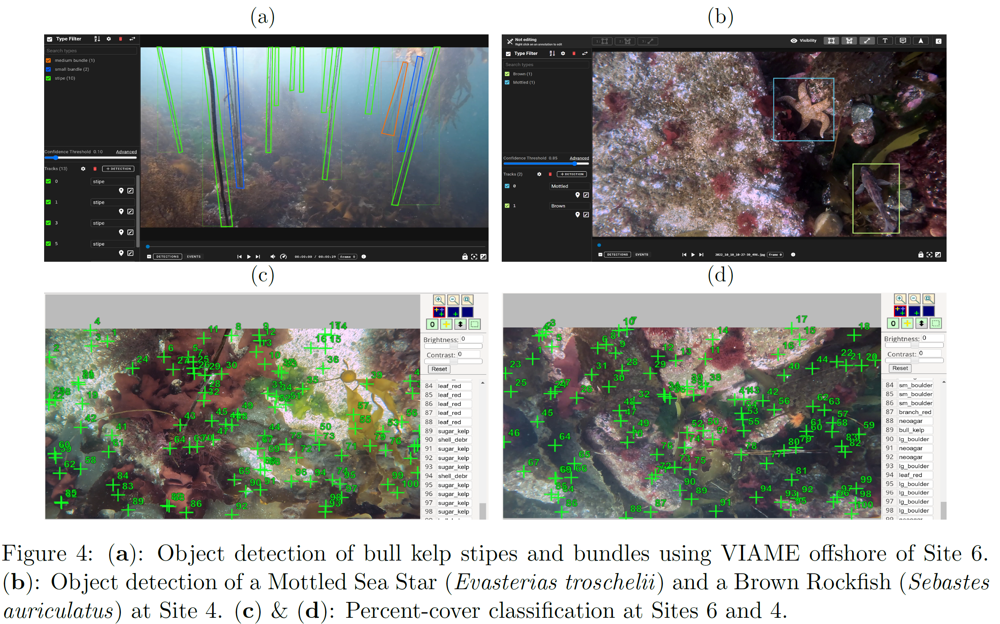

# Seattle_Aquarium_ROV_telemetry_imagery_analysis

## Overview

This is a public repository to organize information pertaining to the analysis and visualization of ROV telemetry, spatial data, and preliminary AI analyses of species, taxa, and substrate type via [CoralNet](https://coralnet.ucsd.edu/) and [VIAME](https://www.viametoolkit.org/wp-content/uploads/2020/09/VIAME-AI-Workshop-Aug2020.pdf). Our overarching objective here is to provide an open-source location in which we store code and resources necessary for other entities or individuals to reproduce our ROV telemetry and sensor file management and analyses. Furthermore, this repository will provide a central location to hash out problems and discuss results, as exhibited in the [Issues](https://github.com/zhrandell/Seattle_Aquarium_ROV_telemetry_imagery_analysis/issues?q=is%3Aissue+is%3Aclosed) tab above to the top left (for example, linked [here](https://github.com/zhrandell/Seattle_Aquarium_ROV_telemetry_imagery_analysis/issues/9) you'll find an issue discussing how to calculate the area of seafloor filmed by our downward-facing GoPro video, and linked [here](https://github.com/zhrandell/Seattle_Aquarium_ROV_telemetry_imagery_analysis/issues/8) you'll find an issue that walks through the code necessary to simulate GPS coordinates of ROV transects in instances where the acoustic GPS system exhibited errors.   

For more general information about this ROV project including summary documentation, ROV videos, and photos from its deployment, see our other public repo [Seattle_Aquarium_ROV_development](https://github.com/zhrandell/Seattle_Aquarium_ROV_development)

* Code can be found [here](https://github.com/zhrandell/Seattle_Aquarium_ROV_telemetry_imagery_analysis/tree/main/code).
* We are fortunate to be working with [Clyde McQueen](https://github.com/clydemcqueen), who’s assisting with a variety of software aspects of our project, including the development of custom software to enable “terrain following” (dubbed _surftrak_), where the ROV auto-adjusts its altitude over varying seafloor based upon readings from the Ping Sonar Altimeter. For more information, please see Clyde’s [_surftrak_ repository](https://github.com/clydemcqueen/ardusub_surftrak). 
* Clyde has also made Python scripts available to help process and analyze ROV telemetry logs from ROVs running ArduSub -- those scripts can be accessed [here](https://github.com/clydemcqueen/ardusub_log_tools).
* Clyde also made a [BlueOS Extension](https://discuss.bluerobotics.com/t/external-integrations-extensions/10912) that listens for NMEA messages from our GNSS Satellite compass and feeds that information to our WaterLinked UGPS G2 box. This has greatly aided our efforts to obtain precise GPS positioning information about the ROV. This BlueOS extension is open-source and can be downloaded [here](https://github.com/clydemcqueen/wl_ugps_external_extension).    
* As an example of the two AI analyses programs we are using, see figure 4 below, taken from our 2022 year-end report to the Port of Seattle, which itself can be downloaded [here](https://drive.google.com/file/d/1HJUBRQQiuhMxuoTgmrHuluVSnRD-cZ3M/view).  
* To view the 66 percent-cover categories of red, green, & brown algae, substrate types, sessile and mobile invertebrates, and fishes that we have created in CoralNet, view [this](https://github.com/zhrandell/Seattle_Aquarium_ROV_telemetry_imagery_analysis/blob/main/documents/CoralNet_Classifications.xlsx) *.xlsx* document (click "view raw" or "download").
* To view our *Overarching_Workflow.xlsx* document, tracking the precise steps required throughout file (e.g., *.bin*, *.csv*, *.mp4*, *.jpg*) creation, processing, merging, saving, analysis, etc., see [this](https://github.com/zhrandell/Seattle_Aquarium_ROV_telemetry_imagery_analysis/blob/main/documents/Overarching_Workflow.xlsx) *.xlsx* document (click "view raw" or "download"). 

  
  
   
  
  

