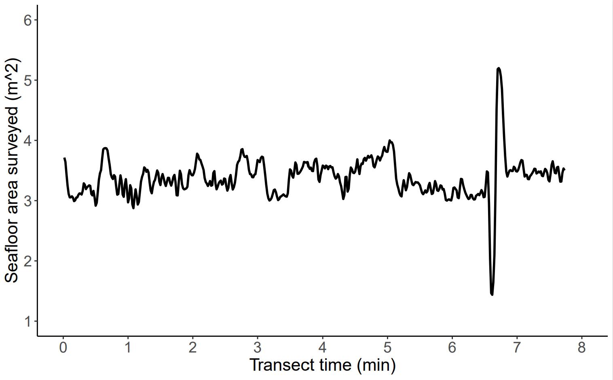

# Seattle_Aquarium_ROV_telemetry_imagery_analysis

## Overview

This is a public repository to organize information pertaining to the analysis and visualization of ROV telemetry, spatial data, and preliminary analyses of species and habitat percent cover via CoralNet. Mapping and spatial analyses comprise a large bulk of the analytical deliverables associated with our Coastal Complexity & Resilience (CCR) program. This is because the ROV methods we've developed have the potential to provide novel insight into benthic community structure across large stretches of geospatially referenced seafloor. Our overarching objective here is to unite the various community structure, benthic habitat, and satellite-derived data streams, along with ROV-derived telemetry information (e.g., GPS coordinates). This repository will provide a central location to store resources, links, code, figures, and hash out problems and discuss results (see "issues" at the top left of the repo webpage), e.g., [Issue #1](https://github.com/zhrandell/Seattle_Aquarium_ROV_telemetry_and_mapping/issues/1) walks through the raw vs processed ROV telemetry file, and [Issue #2](https://github.com/zhrandell/Seattle_Aquarium_ROV_telemetry_and_mapping/issues/2) lays out preliminary processing of GPS tracks. 

For more general information about this ROV project including summary documentation, ROV videos, and photos from its deployment, see our other public repo [Seattle_Aquarium_ROV_development](https://github.com/zhrandell/Seattle_Aquarium_ROV_development)

* To view code associated with the processing and merging of Ping Sonar Altimeter *.bin* files and ROV telemetry *.csv* files, as well as the extraction of stills from 4K 30FPS GoPro video, view [this](https://github.com/zhrandell/Seattle_Aquarium_ROV_telemetry_imagery_analysis/tree/main/code) page.
* To view the 66 percent-cover categories of red, green, & brown algae, substrate types, sessile and mobile invertebrates, and fishes that we have created in CoralNet, view [this](https://github.com/zhrandell/Seattle_Aquarium_ROV_telemetry_imagery_analysis/blob/main/documents/CoralNet_Classifications.xlsx) *.xlsx* document (click "view raw" or "download").
* To view our *Overarching_Workflow.xlsx* document, tracking the precise steps required throughout file (e.g., *.bin*, *.csv*, *.mp4*, *.jpg*) creation, processing, merging, saving, analysis, etc., see [this](https://github.com/zhrandell/Seattle_Aquarium_ROV_telemetry_imagery_analysis/blob/main/documents/Overarching_Workflow.xlsx) *.xlsx* document (click "view raw" or "download"). 
* To view a August progress report to the Port of Seattle regarding our Urban Kelp Research Project, see here for the [*.TeX*](https://github.com/zhrandell/Seattle_Aquarium_ROV_telemetry_imagery_analysis/blob/main/documents/Port_report_August/Urban_Kelp_August_report.tex) file.
* To view online coding resources for R and GitHub, view [this](https://github.com/zhrandell/Seattle_Aquarium_ROV_telemetry_and_mapping/blob/main/documents/coding_resources.md) *.md* document. 
* To view resources for spatial analyses in R, view [this](https://github.com/zhrandell/Seattle_Aquarium_ROV_telemetry_and_mapping/blob/main/documents/spatial_resources.md) *.md* document.
* To view summary information about our various data streams, view [this](https://github.com/zhrandell/Seattle_Aquarium_ROV_telemetry_and_mapping/blob/main/documents/data_streams.md) *.md* document.

  
   
   

