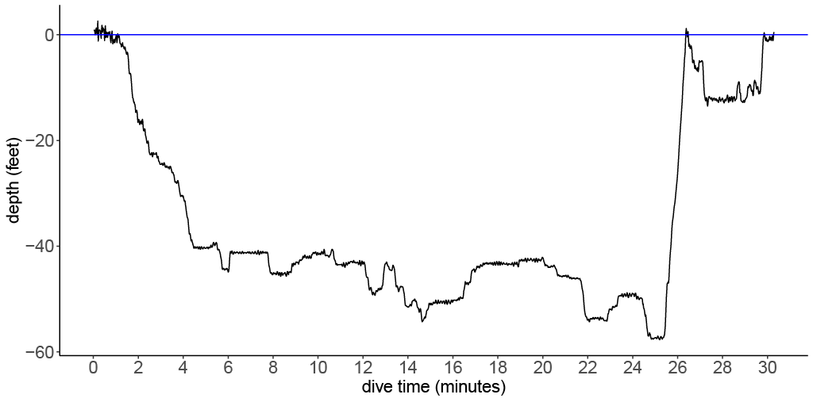
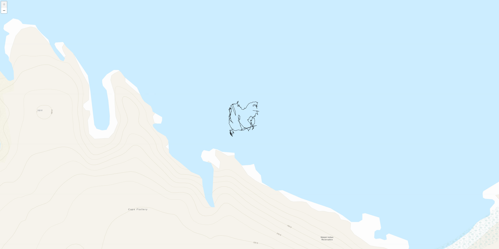
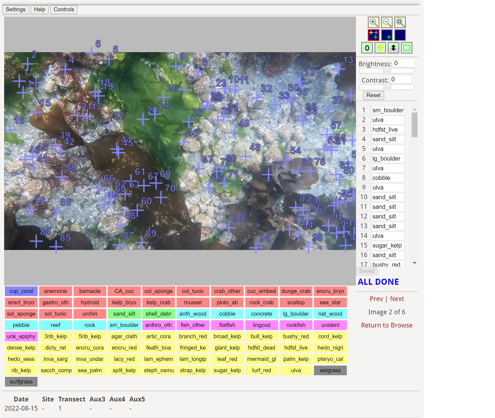

# Seattle_Aquarium_ROV_telemetry_and_mapping

## Overview

This is a public repository to organize information pertaining to the analysis and visualization of ROV telemetry, spatial data, and preliminary analyses of % cover via CoralNet. Mapping and spatial analyses comprise a large bulk of the analytical deliverables associated with our Coastal Complexity & Resilience (CCR) program. This is because the ROV methods we've developed have the potential to provide novel insight into benthic community structure across large stretches of geospatially referenced seafloor. Our overarching objective is to unite the various community structure, benthic habitat, and satellite-derived data streams, along with ROV-derived telemetry information (e.g., GPS coordinates). This repository will provide a central location to store resources, links, code, figures, and hash out problems and discuss results (see "issues" at the top left of the repo webpage), e.g., [Issue #1](https://github.com/zhrandell/Seattle_Aquarium_ROV_telemetry_and_mapping/issues/1) walks through the raw vs processed ROV telemetry file, and [Issue #2](https://github.com/zhrandell/Seattle_Aquarium_ROV_telemetry_and_mapping/issues/2) lays out preliminary processing of GPS tracks. 

* to view online coding resources for R and GitHub, view [this](https://github.com/zhrandell/Seattle_Aquarium_ROV_telemetry_and_mapping/blob/main/documents/coding_resources.md) *markdown* document
* to view resources for spatial analyses in R, view [this](https://github.com/zhrandell/Seattle_Aquarium_ROV_telemetry_and_mapping/blob/main/documents/spatial_resources.md) *markdown* document
* to view summary information about our various data streams, view [this](https://github.com/zhrandell/Seattle_Aquarium_ROV_telemetry_and_mapping/blob/main/documents/data_streams.md) *markdown* document

  
  

  

